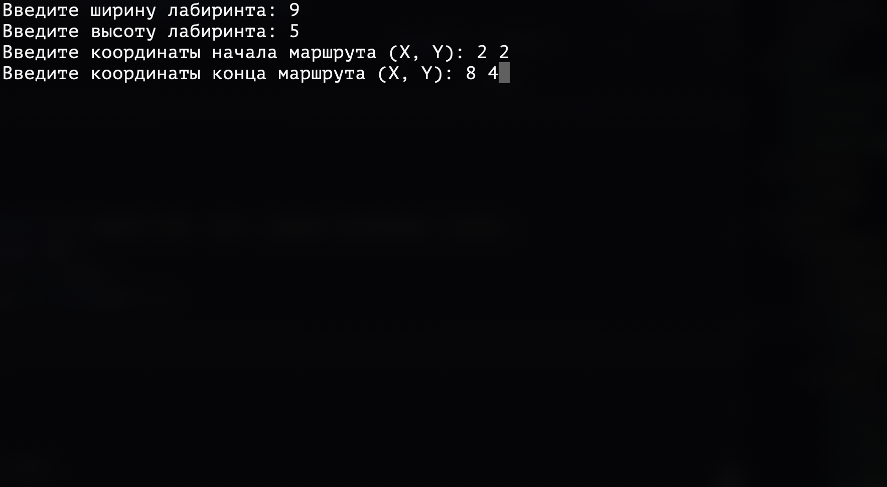
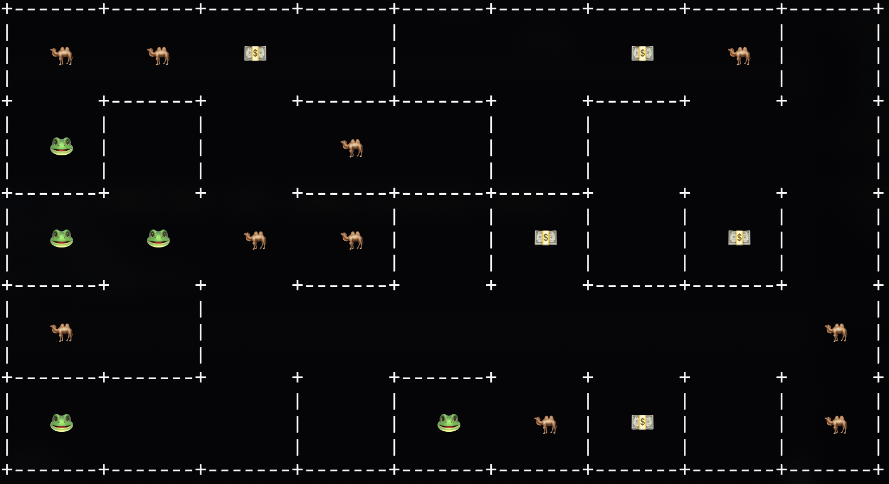
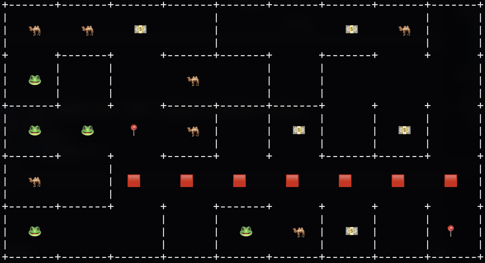

# 🌀 Генератор и решатель лабиринтов — консольная программа на Go

Консольное приложение для генерации лабиринтов разного размера и сложности, а также поиска пути от точки **A** (старт) до точки **B** (финиш). Поддержка нескольких алгоритмов генерации и поиска, наглядная отрисовка лабиринта и найденного пути прямо в терминале.

---

## 🧩 Возможности
- 🏗 Генерация лабиринтов различного размера и сложности
- 🔀 Поддержка как минимум 2-х алгоритмов генерации (Прима, Краскала)
- 🧭 Поиск пути из точки A в точку B с помощью разных алгоритмов (Форда-Беллмана, A*)
- 🎨 Символьная отрисовка лабиринта в консоли
- 📍 Отображение точек старта и конца
- 🛣 Печать найденного пути в лабиринте
- ❌ Обработка некорректного ввода (размеры, координаты)

---

## 🛠 Установка и запуск

### Способ 1: запуск напрямую
```bash
git clone https://github.com/andreylikhterman/maze.git
cd maze
go run cmd/maze/main.go
```

### Способ 2: сборка и запуск бинарника
```bash
git clone https://github.com/andreylikhterman/maze.git
cd maze
make build
./bin/maze
```

📸 Пример работы программы




